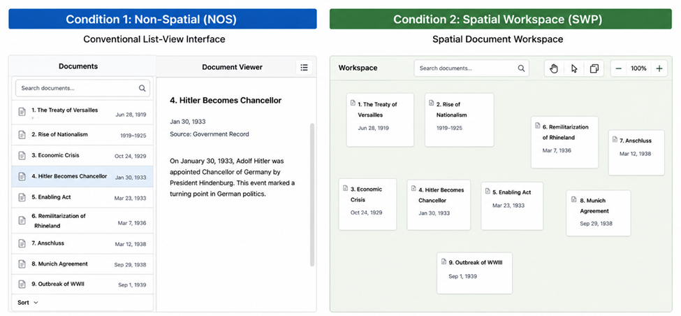

# Document Study

A minimal React app for comparing two ways of reviewing and organizing the same document collection.

## Intial design (based on which we have created this system)



## Interfaces

- **NOS (Non-Spatial):** a conventional searchable document list and document viewer. Search highlights matching text and matching documents, but documents cannot be spatially organized.
- **SWP (Spatial Workspace):** a free canvas where documents remain visible and can be dragged into any arrangement. Search highlights matching text and documents in red.

Neither interface displays document dates. Participants must infer a timeline from document content alone.

## Study metrics

Metrics reset when a JSON collection is loaded. NOS counts each successful list reorder. SWP counts each completed card drag and accumulates its Euclidean distance in canvas pixels, both overall and for each card. Initial and current area are the axis-aligned bounding-box area around all spatial cards, including their resized dimensions; the current value becomes the final value when the session ends.

Use **Export stats** to review the measurements in a confirmation dialog before downloading them as JSON. Updates are also logged to the browser console for debugging.

## Run locally

```bash
npm install
npm run dev
```

The app starts empty. Use **Load JSON** in the header to open a collection. A sample file is available at [`examples/documents.json`](examples/documents.json).

## Supported JSON schema

```json
{
  "version": 1,
  "documents": [
    {
      "id": "unique-document-id",
      "title": "Document title",
      "content": "Document text shown in both interfaces.",
      "metadata": {
        "source": "Optional value",
        "anyOtherField": "Optional value"
      }
    }
  ]
}
```

Each document requires a unique string `id`, a string `title`, and string `content`. `metadata` is an optional JSON object for any extra user-defined information. The frontend accepts it but does not display, search, or otherwise consume it.

## Build

```bash
npm run build
```
